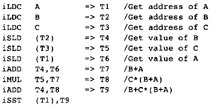

第4章 流图
############

编译器前端完成了它的任务，也就是它为每个被编译的程序创建了抽象语法树和符号表。现在，编译器将构建一种新的表示，用于改进程序（优化）、代码生成、指令调度和寄存器分配。首先，我们必须作两个关于编译器结构的决定。

4.1 如何存储程序？
*******************

编译器用多种数据结构表示被编译的程序。在一种极端形式下，程序可能被表示为一棵树；在另一种极端形式下，程序可能被表示为一组目标机器的机器指令序列。

把程序表示为一棵树，能够清晰地表示程序的原始结构。一个程序由声明、语句和表达式组成。它们包含相同形式的组件，因此这种表示方法是自然的。如果采用树的结构，那么抽象语法树是自然的选择。对于以树为导向的优化算法而言，例如代数同一性和Sethi-Ullman寄存器编码，抽象语法树是自然的组织形式。

把程序表示为机器指令序列，能够让很多优化算法变得容易。程序可以被单独优化和移位。最快的指令序列并不自然地对应抽象语法树。单个指令必须易于操纵、创建、复制、删除或者移动，指令序列比抽象语法树更容易实现这些动作。

本编译器吸收了树和指令序列两者的优势。针对一种抽象的RISC处理器，程序被表示为指令序列的流图。这种抽象的机器有无限量的寄存器，称为临时变量。它有一套标准的指令集，用于操作整数、长整数、浮点数和双精度浮点数。

应用以树为导向的算法时，程序表示被翻译为一种称为静态单赋值（SSA）的形式。当编译器将流图翻译为SSA形式时，编译器重新构造表达式树，然后以树为导向的算法就可以使用之。编译器还会计算程序中的嵌套循环，提供语句的树结构，这是特别有用的。

汇编语言程序不表示为文本。正如第2章提到的那样，它存储为有向图，称为流图。流图衍生于本来应用于动态规划的流程图（flow chart）思想。流图有下面这些组件：

指令很像抽象RISC处理器的机器指令。每条指令由一个操作符（opcode）、一组输入操作数和一组输出目标组成，其中操作符表示执行的操作，输入操作数表示操作的对象，输出目标表示被修改的变量。

一条指令的操作数是常量或者临时变量。临时变量集合是任意大的集合，类似真实处理器的物理寄存器。每个临时变量为某个程序段存放一个值。有些指令会求值表达式，并将求得的值存放在目标临时变量中。使用这个值的指令将相应的临时变量引用为操作数。

指令构成程序的方式类似于真实处理器上汇编代码构成程序。执行从第一条指令开始。指令按次序执行，直到遇到一条跳转指令。指令分组为序列，称为块（block）。块的第一条指令是某条跳转指令的目标，是块中唯一的这样的指令。块的最后一条指令是块中唯一的跳转指令。在块的末尾，有一条跳转指令，指示跳出这个块的可能路径。

块构成流图，它们是流图中的节点。块之间的变表示离开块的可能执行路径。边(B1, B2)表示程序执行的时候可以从B1直接走到B2。流图有两个特殊的节点：起点块Entry和退出块Exit。

考虑图4.1中的程序片段，它表示计算语句 A = B + C * (B + A)。计算被分解成多个计算。在引用一个变量的值之前，必须载入变量的地址，并执行对变量的载入操作。所有载入的值都存放在临时变量中。由于排版的目的，整数临时变量表示为整数加一个前缀字母T。注意，A和B的地址载入了一次，用了两次。名字A代表变量A的常量地址。B的值载入了一次，用了两次。这些是冗余表达式消除的例子。后面会描述单个操作名称（或者操作符）：iLDC代表载入整数常量，iSLD代表从静态内存载入整数值，iADD是整数加法，iMUL是整数乘法，iSST代表向静态内存存储整数。这些名称来自莱斯大学的大规模标量编译器项目。

考虑图4.2中的涉及循环和分支的例子，它计算2的整数次幂。参数是幂，它控制循环执行的次数。该程序的流图（图4.3）体现了流图的若干特征。流图以prolog指令开始，以epilog指令结束，它们是特殊的伪指令。它们代表在程序的开头和结尾处需要执行的计算。注意，prolog接收一个参数，就是程序的实际参数。在这个例子中，这个参数是i，它存储在临时变量T1中。

    图4.1 A = B + C * (B+A)的表示

    图4.2 示例程序

这个程序流图由标记为B0、B1和B2的块组成。有向图以一个块开始。块由若干数量的计算指令和一条紧随其后的跳转指令组成。条件跳转指令iBCOND有两个块标记，代表两路分支，执行的时候跳转到哪个分支是未知的。如果条件为真，那么第一个块标记是跳转的目标。如果条件为假，那么第二个块标记是跳转的目标。

    图4.3 示例程序的程序流图

    图4.4 示例程序的有向流图

跳转指令代表控制流。中间表示是一个有向图，G = (N, E)，其中每个节点B ∈ N，称为块，表示计算指令序列紧跟一条跳转语句（见图4.4）。跳转指令的操作数包含若干个块，它们是跳转的可能目标。边(P, F) ∈ E，表示块P中有一条跳转语句，它可能跳转到目标F。

4.2 是否低层化中间表示？
*************************

起初，程序被表示为抽象语法树。然后它被翻译为流图。在编译过程中，编译器逐步修改流图，直到流图显式地表示一系列目标机器指令。这个逐步修改的过程称为低层化。这样，编译器的各个phase低层化流图，逐步去除源语言细节，代之以目标机器指令细节。

起初，流图表示一个计算序列；然而，细节层级跟抽象语法树相同。很多计算，比如加法和乘法，它们本身是简单的，因此不需要细节低层化。更多复杂操作，比如数组引用和函数调用，表示为抽象层级。

考虑数组元素引用，A[I,J]，其中A是一个N x N的整数数组，下标取值范围是1到N。这样的数组被实现为一个存储块。数组的单个元素（在Fortran中）用下标公式引用：address(A[I,j}) = address(A) + sizeof(int)*(N*(J-1) + (I-1))。

当编译器构建流图的时候，它会把数组引用翻译为一组加法和乘法，如上面给出的公式那样；然而，大部分实际数组引用的信息丢失了。需要数组引用信息的编译器phase将得不到准确的信息。

相反，编译器会创建数组载入操作和存储操作，它们的操作数包含数组名字、下标、范围等。当不再使用数组信息时，编译器把这些操作翻译为公式隐含的更简单的算术运算和内存引用。换句话说，将高层级的操作替换为更简单的指令级操作，这样就低层化了流图层级。

过程和函数调用也是逐步低层化的。函数调用和过程调用有单独的算子。起初，这些算子的参数是子函数的名字（或者求值子函数名字的表达式）和实际参数列表。过程调用的目标机器细节被忽略。函数或者过程调用的层级保持为原始程序的层级。完成过程间分析和内联之后，过程调用被替换为一系列指令，这些指令达成调用子函数并返回的效果。

代码生成，或者说到目标机器指令的翻译，是低层化的特殊实例。程序流图模仿针对抽象RISC处理器的汇编语言程序的结构。在很多目标机器指令和流图能表示的操作之间存在一一对应的关系。如果有的目标机器操作在流图中表示为一条指令，那么这些操作会被转换为一系列算子指令。在最终的优化phase之前，流图会被低层化到只使用那些对应单一目标机器指令的算子指令。

流图中有些通用操作能被视作宏而被展开。在早期的Alpha处理器上，字节的载入和存储操作就是这样的例子。载入字节需要多条指令。如果一开始就生成这样的一组指令，那么有些优化就做不了。类似地，和常数相乘会被展开为一组移位和加法指令。这些都是逐步低层化的例子，不能一开始就低层化它们，而是在最终的优化phase之前低层化它们，如此每条指令才能被优化。

有些目标机器操作可能表示为流图中的多条指令。最明显的例子是载入和存储操作，它们接收两个参数，一个寄存器和一个常数。寄存器和常数相加，计算出地址。载入操作执行两种运算：加法和读取。在原始的流图中，它们被表示为两条不同的指令。在最终的优化phase之前，这两条指令被合并成一条单一指令。

编译器假设流图中的控制流是显式表示的。换句话说，控制流不是逐步低层化的。有些控制流隐藏在未被低层化的指令中，例如求最大值和求最小值操作。然而，控制流进入指令时，指令有一系列输入，控制流离开指令时（除了跳转等指令），指令有一系列输出，每条指令都是如此。

4.3 构建流图
**************

这一节描述编译器中将抽象语法树翻译为流图的代码。首先，考虑两种情形，表达式和循环；然后，我们会描述编译器中代码的结构。

考虑早前讨论过的语句：A = B + C * (B + A)。相应的抽象语法树如图4.5所示。树是这样表示的（如前），根节点位于最左侧，每个子节点位于父节点下面并且向右缩进。树会注释以类型信息，这是不记录的。标注symbol("A")用以指示一个符号节点，指向符号表中变量A的符号。

.. figure:: chapter04/figure-4.5.png

    图 4.5  A = B + C * (B+A)的抽象语法树

我们知道语言的语义可以分成两种不同的规则：静态和动态语义。静态语义是描述语言的结构化规则（除了词法和解析结构）的规则集合。例如，符号必须先定义后使用，这是静态语义规则。动态语义是描述语言各个部分作用的规则集合。执行加法之前必须先求值其操作数（可能指定操作数求值的顺序），或者赋值语句的含义是计算左侧的地址，计算右侧的值，再将来自右侧的值存储到左侧所指定的地址中，这些都属于动态语义。这些规则都属于语言标准或者规范。[1]_

.. [1] 很多编译器编写者，包括我，找到了不错的工作，因为很多人不了解动态语义。很多程序员以为，语法定义一门语言。语法只是这项工作的一小部分。真正的难点在于描述静态和动态语义，和不同动态语义规则之间的交互。

语言定义针对语言结构体和它的操作数描述动态语义。为了构建赋值语句，编译器必须能够建立操作数。这种树结构方法适合每个结构体。这个事实表明，按照语言结构体的动态语义所描述的次序自下而上遍历抽象语法树，就可以构建流图。对于有的节点，例如循环，自下而上遍历树是不够的：指令可能在子节点生成之前生成，在子节点生成之时生成，或者在子节点生成之后生成。

这里的树遍历比简单的自下而上树遍历稍微复杂一点，因为处理树节点要考虑其上下文，上下文不同则处理也不同。下面列出了若干种上下文，根据语言的复杂度，可能需要更多种上下文：

Value上下文：当操作数是一个表达式时，编译器会处理它并创建一个临时变量以存放表达式的值。在此函数中，编译器会向流图插入指令。实现了此遍历的函数是temporary value_work(ast * node)。

NoValue上下文：当子树是一个语句或者一个用作语句的表达式时，编译器遍历这个子树，创建指令来表达子树的效果，但是不创建临时变量以存放任何最终的值。这里有一个优化的机会。编译器需要创建的指令仅仅是那些表达子树效果的指令，有些指令是不需要生成的。实现此遍历的函数是void novalue_walk(ast * node)。

Flow Value上下文：当子树表示一个用于确定跳转的表达式时，如果编译器在遍历这个子树时一块儿生成测试和跳转指令，就可以生成更高效的指令。实现流上下文遍历的函数需要两个增加的参数：条件表达式分别为真和假时的跳转目标块，见void flow_walk(ast * node, block * true_block, block * false_block)。

Size上下文：当需要子树表示的数据的大小时，必须遍历子树，生成一个临时变量来存放数据的大小这个值。此函数的调用序列和Value上下文的函数一样。它只是计算数据大小，一个不同的值：temporary size_context(ast * node)。

在讨论上述各个树遍历函数的结构之前（它们都是相似的），我们必须了解用于构建流图的支持函数的结构。这些函数是结构化的，这样树遍历看起来会很像动态语义规则。

4.3.1 初始构建流图的支持函数
==============================

有两组操作流图的支持函数。一组支持在任意块插入任意指令，一组支持在两个块构成的边上插入另一个块。实际上，这是完全通用的一组操作流图的函数。编译器利用这些函数（后面将介绍它们）初始创建流图。

这些用于初始构建流图的函数很像汇编语言编写者。有时向流图添加一条指令。在一条跳转指令之后开始一个块，或者以一条作为跳转目标的指令开始一个块。所有新建的指令都添加到当前块的末尾，直到开始一个新的块。当前块结束，则开始一个新的块。支持函数区分新建一个块和开始一个块。任何时候可能新建一个块。当块创建时，条件跳转指令可以引用它，也就是说，它可以作为跳转目标。然而，这个块还未添加任何指令。之后，编译器可以开始这个块，就是把它作为当前块，所有新建的指令都添加到这个块，直到开始下一个块。

为何如此区分？编译器创建条件跳转指令时，可能流图中还不存在跳转的目标块，而条件跳转指令必须引用它们。考虑一个if语句。创建条件跳转指令时，then部分和else部分都未处理。因此，在创建条件跳转指令之前，编译器分别为then部分和else部分创建一个块。之后处理then部分和else部分时，把指令添加到相应的块。这样可能导致空的块。单独的编译器phase会消除这些空的块。

下面是用于构建初始流图的支持函数：

initialize_graph：这个函数为流图和关联的表创建空的数据结构。它新建两个块，Entry和Exit，它们分别是流图的开始块和退出块。然后，让Entry块成为当前块，这样初始指令会被添加到这个块。

create_block：这个函数创建一个新的块，初始化为空的块。它的返回值就是这个块。

start_block：这个函数接收一个块作为参数，让它成为当前块。所有后续的指令都会添加到它的末尾。

xxx_instruct：这个函数创建某个种类的指令，流图中各个种类的指令都有一个单独的支持函数。指令的参数包括操作符、输入常量或者临时变量、输出临时变量等。针对载入和存储指令，会传入更多数据，指示这些指令可能会修改哪些存储位置。

cond_instruct：这个函数创建条件跳转指令，它终止当前块，为当前块到每个跳转目标块建立边，这样让流图的边保持更新。这个支持函数的参数如下：操作符，其值被测试的临时变量，条件为真时的目标块，和条件为假时的目标块。

uncond_instruct：这个函数创建无条件跳转指令，它只有一个参数：跳转的目标块。它终止当前块，为当前块到目标块建立边。

new_temporary：这个函数接收一个枚举类别作为参数，这个参数指示所引用的寄存器类别。然后，初始化一个临时变量，并且返回它。

处理临时变量也有支持函数。我们假设有无限数量临时变量（虚拟寄存器）可用，因此任意时刻需要临时变量就创建一个。然而，为了减轻后续优化phase的工作，针对临时变量的使用需要作一些约定。之后在限制资源phase，有些约定会被解除。

基本约定：每次计算一个正规的表达式时，例如B + A，总是在相同的临时变量中计算。为何？代码移动算法和消除冗余表达式算法需要知道值存放在何处。如果知道B + A的一个实例是冗余的，编译器就想要删除它。为此，编译器必须查找剩余的流图，找出所有计算B + A的点，把结果复制到一个临时变量，用它替换冗余表达式。相反，编译器总是在相同的临时变量中计算B + A，这样只需要删除这个冗余计算。

为了实现上述约定，编译器建立一个数据结构，称为“正规临时变量表”，[2]_ 它包含指令的操作符和输入，还有存放结果的临时变量。即使指令在流图中出现多次，它在正规临时变量表中只有唯一一项记录。

.. [2] 这个想法是由Chow (1983)在其论文中首次提出的，后来被COMPASS编译器引擎采用，这里采用的是其简化形式。COMPASS方法试图将这个表用作太多的用途。

由于先计算操作数后计算表达式，表达式所引用的临时变量在使用之前被计算。当一条指令正在生成时，以它的操作符和输入作为键值，去查询正规临时变量表。如果指令已经在表中，那么用相同的临时变量存放指令结果。如果这是一条新的指令，那么向表中插入一条新的记录，连同一个新的临时变量。

4.3.2 处理局部变量为临时变量
==============================

函数中的局部变量可以被处理为临时变量，假如没有语句使用其地址。此时，临时变量用于存放局部变量的值。临时变量也用在树中，在抽象语法树中表示获取局部变量。如果编译器不能将变量保持在寄存器中，那么之后会将它存储在内存中。

这个优化有两个好处。如果编译器能够优化哪些变量保持在寄存器中，就会生成更好的代码。消除加载和存储指令比在需要时插入它们更难。其次，这会减小流图的大小，使得所有优化算法跑得更快。

这导致一种情形，它约定具体相同输入的相同指令肯定是那些使用相同目标寄存器的指令。考虑两个不同的赋值语句，给i赋值，i = i + 1 和 i = i * 3。假设表示局部变量i的临时变量是T1。把这些值赋给i的行为意味着有两个不同的寄存器到寄存器的复制操作，它们的目标都是T1。

事实上，临时变量分成不同的两类：变量临时变量和表达式临时变量。表达式临时变量满足上面描述的标准。以其中之一作为目标寄存器的所有指令都具有完全相同的形式。其它的都是变量临时变量。不同的指令类别会应用不同的优化。

4.3.3 树遍历算法的结构
========================

现在我们有了描述树遍历的基础设施，而树遍历用于实现流图。我们将讨论如何实现五个特性：表达式，条件表达式，跳转表达式，结构化语句，goto语句等。

考虑有返回值的表达式或者节点，从它们的树遍历函数中可以看出树遍历函数的结构（图4.6）。所有其它函数都是类似的。函数的结构是一个case语句，一个case对应一个抽象语法树节点，该节点可以在表达式中被表示出来（对于其它树遍历函数，可能出现不同的节点，或者不出现）。每个函数有一个不变断言，当一棵子树完成遍历时，所有该子树关联的指令都已经插入到了流图中。

考虑抽象语法树中的plus节点所关联的case选项。首先按照语言的动态语义指定的次序遍历它的子节点，这里次序为从左到右。然后向流图添加指令，以执行恰当的操作，模拟动态语义。这里，它检查表达式的类型，生成整数、浮点数或者双精度浮点数的加法操作。

    图4.6 表达式树遍历的结构

函数Binary_Instruct用于生成二元指令。它有一个指令操作符，两个临时变量操作数，生成并且返回结果临时变量。这个函数利用正规临时变量表，确保当操作符和操作数相同时，结果临时变量总是相同的。它也把指令而插入到当前块，作为最新的指令。

现在考虑常量节点。它没有子树，因此树遍历函数得到节点关联的数据（这里为常量值），生成一条指令，它只有一个常量操作数。同样地，为相同的常量实例使用相同的临时变量，指令被插入到当前块的末尾。

如果一个抽象语法树的节点不返回值，就没有它的case语句选项。如果在期望表达式的地方出现这样的节点，编译器就会给出一个系统错误消息。这样的检查是有价值的，因为它检查抽象语法树的合法结构，对于正确的树而言，检查不会造成开销。

处理结构化语句
++++++++++++++++

NoValue_Walk函数用于处理语句。处理像函数调用这样的语句，跟处理表达式类似。跳转和结构化语句是不同的，因为它们会改变当前块，而当前指令会被插入到当前块。

考虑while循环相应的case语句选项。考虑一个编译器将要生成的流图（图4.7）。这里将解释该case选项中的代码。编译器会生成两份循环测试。第一份出现在当前块，决定是否执行该循环。如果循环需要被执行，就走到循环体的代码。第二份循环测试出现在循环体的末尾，决定是否需要再次执行循环。这样的循环表示形式比大多数书本中出现的更复杂。选择这样的形式是为了发现更多将代码移出循环的机会。

这样，在处理while循环时，编译器至少会开始两个块。第一个块是循环体的；第二个块跟在循环体之后。为了能够跳转到循环体之后的块，编译器必须创建这第二个块。

    图4.7 while循环的流图

我们知道，while语句内部可以出现break语句。为了处理这样的（break）语句，编译器会维护一个块的堆栈，其中的块是跟在循环语句之后的块。如果出现一个break语句，就生成一条跳转指令，跳转到栈顶的那个块。有了这些信息，我们就能解释NoValue_Walk中while循环和break语句相应的代码（图4.8）。

条件跳转表达式
++++++++++++++++

逻辑AND，逻辑OR，和逻辑NOT，这些短路操作采用特殊处理方式。如果逻辑AND的第一个参数是假，它就是假；否则，它等于第二个参数。如果逻辑OR的第一个参数是真，它就是真；否则，它等于第二个参数。flow_walk函数实现这些操作，连同条件跳转，由于比较。

结构类似于其它的遍历，如图4.9所示。它直接实现了上面的短路操作符的描述方法。这种方法的优美之处在于逻辑操作符的Morgan定律是自动生成的。

比较操作调用Value_Walk函数以求值二元比较运算。结果是一个布尔值，之后条件跳转指令用它作测试。

相反的情形出现在Value_Walk中，它调用flow_walk以实现短路逻辑AND和逻辑OR操作。编译器把它们当作条件表达式。在C语言中，这意味着，A && B被当作条件表达式(A && B ? 1 : 0)。

    图4.8 遍历语句片段

条件表达式
+++++++++++++++

要特别注意条件表达式，因为它计算一个值，而它的操作数或者部分操作数来自单独的块，条件表达式是少数这样的表达式之一。这是其中一个理由，之所以选择流图而不是树结构来表示程序。临时变量的概念不要求在相同的块中，因此，可以在一个块中计算一个操作数，而在另一个块中使用它。

考虑一个条件表达式，(E0 ? Et : Ef)。条件表达式E0在当前块中计算。在不同的块中计算其它操作数。结果值放在哪里呢？编译器应该生成一个临时变量来存放这个值。这个临时变量必须是一个编译器生成的变量临时变量。它不满足表达式临时变量的要求：所有以它为目标寄存器的指令都相同。

    图4.9 flow_walk的结构

怎么处理表达式的一个操作数是条件表达式？没有问题。操作数可能在单独的块中计算，编译器应付得了。图4.10中的程序片段处理条件表达式，把它添加到Value_Walk。

图4.10 实现条件表达式

goto语句
+++++++++++

有些翻译技术难以处理goto语句。对我们来说，它相当容易，因为我们开发了足够的数据结构。处理分成两个部分：goto语句本身和label位置。需要执行如下操作：

label是语言中的符号。label在符号表中需要有一个条目，有一个字段记录以该label开始的块。

goto语句翻译为无条件跳转，跳转到label关联的块。如果label还没有关联的块，就用create_block生成一个。

在label出现的地方，在当前块插入一条跳转到该label的跳转指令。事实上结束前一个块。然后针对label关联的块执行start_block。如果label还没有关联的块，就用create_block创建一个。

以上过程将goto语句翻译为无条件跳转。

4.4 数据的结构
*****************

很多语言都能在程序初始化时初始化数据。编译器前端会识别此信息。这小节描述如何存储此信息，使得能够把它传递给对象模块。

编译器必须维护一个数据的映射表，对象模块将包含这些数据。数据包括公共块、外部变量、编译器生成的信息等。表示这些数据的数据结构是相对简单的。只有一个重要的问题。

编译器向符号表添加一个额外的属性，存储要保存的数据。典型地，这些数据是值的一个链表。

那个问题是数据能被重复很多次。公共块和C中的数组初始化都会如此。必须在数据链表中添加一个特殊的重复节点。它有两个属性：重复次数和重复的数据列表。

如果数据不是常量，就在流图中创建赋值语句，以初始化数据。

4.5 块的结构
*****************

每个块是一个指令列表。由于编译器频繁地插入或者删除指令，列表实现为双向链表。列表表示块中指令的执行顺序。因此，块等价于汇编语言中的一个指令序列，它跟在一个label之后直到下一个跳转指令或者label。

在本编译器中，一个块总是开始于一个作为跳转目标的点，结束于一组跳转指令。在块的末尾没有计算指令。这允许编译器重排或者合并块。

之后在指令调度期间，块被转换成小组指令的列表，称为packet。在多指令并发机器上，处理器在每个时钟周期会发出一组指令。这些packet代表编译器所知道的可以发出的小组指令。

除了指令之外，每个块还有描述流图中的边的属性。这样，块B有两个属性：SUCC(B)和PRED(B)。SUCC(B)是程序执行时在B后面执行的块的集合。PRED(B)是程序执行时在B前面执行的块的集合。

4.6 指令的结构
*****************

每条指令，I，由下面的元素组成：

一个操作符，代表枚举类operation_type的一个元素。每个操作有一个名字，不管它是属于原始指令集的高层级操作，还是在编译期间创建的低层级操作。

指令求值时引用的一组临时变量。指令用这些临时变量的值计算值或者作用。在伪代码中，这些临时变量写为Operand(I)。

指令肯定修改的一组临时变量。通常涉及的指令只有一条。然而，不产生简单作用的指令可能修改多个寄存器。因此，过程或者函数调用可能修改一大组寄存器。在伪代码中，这些寄存器写为Target(I)。

4.7 程序流图的结构
*********************

事实上，图的结构表示为后继（SUCC）、前驱（PRED）、块的属性等，因此流图几乎不需要存储信息。有两个特殊的块：Entry和Exit。Entry是流图中没有前驱的单个块，表示程序执行开始的点。Exit是没有后继的单个块，表示程序执行结束的点。

从实现的角度来看，一个过程或者函数的所有关于编译的信息会组织在一起，构成一个流图数据结构。过程间分析需要这样的组织形式。编译器必须能够存储或者获取过程或者函数的所有信息。这简化了过程间分析phase。

4.7.1 关键边
=================

编译器很多转换需要在边上放置计算指令。由于计算都在块中，编译器必须找到等同的块以插入这些计算指令。如果边的末端只有一个后继，就可以把计算指令插入到末端块的最后，因为这条边是这个块唯一的出口路径。如果边的顶端只有一个前驱，就可以把计算指令插入到顶端块的起始，因为这条边是这个块唯一的入口路径。

图4.11 分割关键边

唯一的问题出现在边的末端块有多个后继，边的顶端块有多个前驱，如图4.11所示。这样的边称为关键边（critial edge）。创建一个空的块，并且把原来的边替换为两条边，就可以消除关键边：一条边从原来的末端块到新的块，另一条边从新的块到原来的顶端块。两条新的边都不是关键边，因为一条边的顶端块只有一个前驱，另一条边的末端块只有一个后继。

4.7.2 分类流图中的边
======================

流图中的边可以分成三类。由条件跳转指令跳转到目标块而形成的边称为正常边。这是最常见的边，最容易处理。如果想修改跳转的目标，就直接修改指令，同时修改流图。如果编译器能够判断跳转不会发生或者总是会发生，就可以修改块中的指令和流图的结构。

在程序流图中，对于其它的边，编译器不能通过分析跳转指令判断跳转的目标。这些边称为非正常边。它们出现在C中的setjmp/longjmp操作、有些Fortran输入/输出（I/O）、异常处理、非局部跳转的子函数调用、有些编译器实现的C switch语句等。以上这些情形都可能出现控制转移，根据块中的指令无法判断会发生怎样的控制转移。编译器会构建保守的后继块集合，保证考虑到所有可能的控制转移，但是编译器不能确定具体跳转到何处，有时候甚至不知道是否会跳转。

对优化编译器来说，非正常边是一个难题。大多数优化需要在边上放置计算指令，这意味着必须消除关键边。对于非正常边，这是做不到的，因为无法通过修改块的内容来体现新的块的存在。而且，大多数非正常边是关键边。编译器在实现程序转换的时候必须避免在非正常边是出现问题。3

3COMPASS编译器小组把这个问题称作癞皮狗（Mangy Dog）问题。在实现寄存器分配器的时候首次注意到这个问题。

另一类边是不可能边。很多程序转换算法假设，被编译函数中的每个块都在某条从Entry块到Exit块的路径上。如果一个循环没有出口，循环中的块就不符合上面的假设。编译器必须在此类循环内部的某个块和Exit块之间添加一条边。相比非正常边，不可能边的问题不大，因为它们永远不会执行。如果一个转换需要在这样的边上插入计算，就直接丢弃该计算，因为代码永远不会执行。

4.8 分类临时变量
*******************

考虑表达式(X+Y) * Z，它由两个操作数(X+Y)和Z组成。编译器一开始就创建一组指令，先求值X+Y，然后Z，最后(X+Y) * Z。如果编译器把(X+Y) * Z移动到流图中更早的位置，就必须首先移动(X+Y)和Z。每种优化算法都根据操作数信息来选择放置(X+Y) * Z的位置。如果编译器移动操作数的计算，整个表达式的信息就会过时。必须重新计算该信息。

为了避免重新计算此信息，编译器对流图强制一个约定，这个约定保证优化信息仍然是准确的。每个表达式可以视作一棵表达式树。叶子节点是内存加载操作，或者代表局部变量的临时变量引用，或者特殊的编译器临时变量。内部节点是构成代表操作数的子表达式的算子。编译器将表达式视作一个纯函数（没有副作用），其输入是出现在表达式叶子节点上的临时变量和内存位置，而不是视作表达式直接操作数的函数。因此，(X+Y) * Z视作X、Y和Z的函数，而不是视作(X+Y)的函数。这样，(X+Y)的求值不会阻止整个表达式的移动。这里，编译器依赖所用算法的两个特征：

1. 在Entry到表达式之间的任意路径，在表达式的求值之前都有操作数的求值，并且在它们之间没有指令会修改操作数的值。也就是说，在Entry到(X+Y) * Z的任意路径上，都有(X+Y)的求值，并且在它们之间没有指令会修改X或Y的值。

2. 编译器约定，一个表达式出现多次，每次总是用相同的临时变量存放其值。在我们的例子中，假设X的值存放在T1中，Y的值存放在T2中，Z的值存放在T3中，(X+Y)的值存放在T4中，(X+Y) * Z的值存放在T5中。这样，(X+Y)总是表示为指令T4 = T1 + T2，而整个表达式总是表示为T5 = T4 * T3。

不是所有临时变量满足以上形式。一个代表局部变量的临时变量可以被赋予不同的值。很快我们会看到，被用作加载操作目标的临时变量又被用作复制操作的目标，其间并没有针对相同位置的存储操作。为此，临时变量被分成两类：满足以上两个条件的（表达式临时变量）和不满足以上一个或者两个条件的（变量临时变量）。

为了改进优化，尽量生成表达式临时变量，越多越好。这可能需要在流图中生成额外的复制操作，之后分配寄存器时，它们会被消除。考虑变量临时变量I的增加操作I = I + 1。在流图中，这可以实现为单个整数操作，iADD I,#1 => I。这样的表示形式违反了表达式临时变量的第二个条件，表达式I + 1无法被优化。作为替换，流图将此计算表示为两条指令，iADD I,#1 => T1和i2i T1 => I。这样表示之后，表达式I + 1可以被优化。

对于一个表达式临时变量，改变其值的唯一方法是修改出现在相应表达式树的叶子节点上的其中一个变量临时变量。因此，优化器不将一个操作数的求值视作对整个表达式的修改。相反，优化器假设修改其中一个叶子节点会修改其表达式树包含那个临时变量的所有表达式临时变量。因此，一条指令求值一个直接操作数，不认为它会修改整个表达式，而两个表达式可以被单独优化。

为了独立优化表达式和操作数，在流图中移动操作数时，编译器假设至少会把它向后移动到和整个表达式一样远的地方。本书所描述的优化技术都是这么做的；但是，并不是所有优化技术都是如此。部分冗余消除（Morel and Renvoise 1979）的早期版本有这个问题。Drechsler和Stodel解决了此问题（1988），大部分后来的作者也是。

